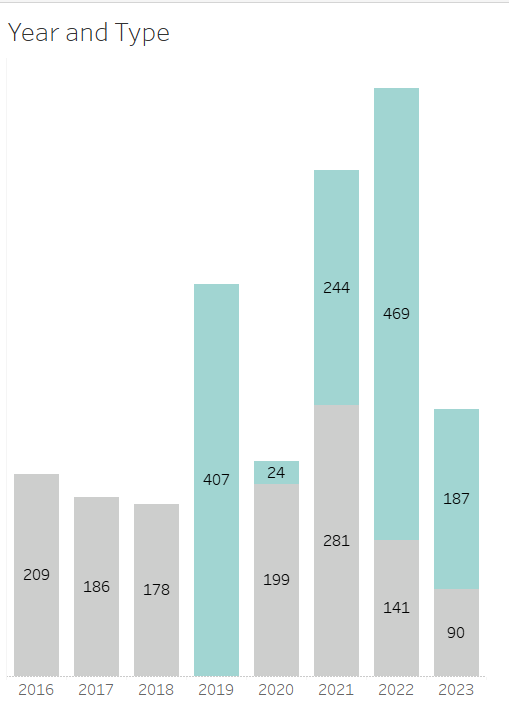

# 🚗 EVL | Washington State Electric Vehicle Insights (Tableau)

This project analyzes the distribution and characteristics of **Electric Vehicles (EVs)** registered in Washington State.  
Using **Tableau**, the dashboard provides insights into **vehicle types, car makes, geography, and adoption trends over time**.

---

## 📌 Business Objective

> Provide an interactive overview of electric vehicle adoption in Washington State to support decisions on **charging infrastructure, policy planning, and OEM market analysis**.

The dashboard helps answer:

- Which **vehicle types** (BEV vs PHEV) dominate the EV population?
- Which **car manufacturers** have the highest number of EVs on the road?
- Which **counties and postcodes** have the most EV registrations?
- How has the EV fleet grown by **vehicle model year**?
- Which **car models** are most widely adopted?

---

## 🧩 Dataset

- **Source**: Washington State Department of Licensing (EV registration data)
- **Key fields**:
  - Vehicle Type (Battery Electric Vehicle, Plug-in Hybrid)
  - Make, Model
  - Model Year
  - County, Postal Code
  - Electric Range, Base MSRP
  - Legislative District
  - Generated Latitude/Longitude for mapping (Tableau)

In Tableau, the data model uses:

- Dimensions: `Make`, `Model`, `Vehicle Type`, `County`, `Postal Code`, `Model Year`, `State`, `Electric Utility`
- Measures: `Electric_Vehicle_Population_Dat (Count)`, `Base MSRP`, `Electric Range`, `Measure Values`
- Extras: parameter filter, sets (e.g., Make–Model views), and generated geospatial fields.

---

## 🛠️ Tech Stack

- **Tableau Desktop**
  - Data connections & joins
  - Sets, parameters, measure values
  - Maps, bar charts, donut charts, stacked bars
- **GitHub**
  - Version control
  - Project documentation (this README)

---

## 📊 Dashboard Highlights

### 1️⃣ Vehicle Type Distribution

- Donut chart comparing:
  - **Battery Electric Vehicle (BEV)**
  - **Plug-in Hybrid Electric Vehicle (PHEV)**
- Quickly shows which powertrain type dominates registrations.

```md

```

### 2️⃣ Make (Brand) Analysis

- Horizontal bar chart of EV count by Make.
- Shows Tesla as the clear leader, followed by Nissan, Chevrolet, Ford, BMW, Kia, Toyota and others.

```md

```

### 3️⃣ Top 10 Counties

- Bar chart of Top 10 Counties by EV count.
- King County has the highest adoption, followed by Snohomish, Pierce, Clark, Kitsap, and others.

```md

```

### 4️⃣ Vehicles Owned by Postcode (Map)

- Map view of EV locations by postal code.
- Bubble size indicates EV population, with clusters around major metro areas in Washington.

```md

```

### 5️⃣ Vehicle Year and Type

- Stacked column chart by Model Year and Vehicle Type.
- Highlights rapid growth of EV registrations in recent years (e.g., 2019–2022).

```md

```

📁 Project Structure
